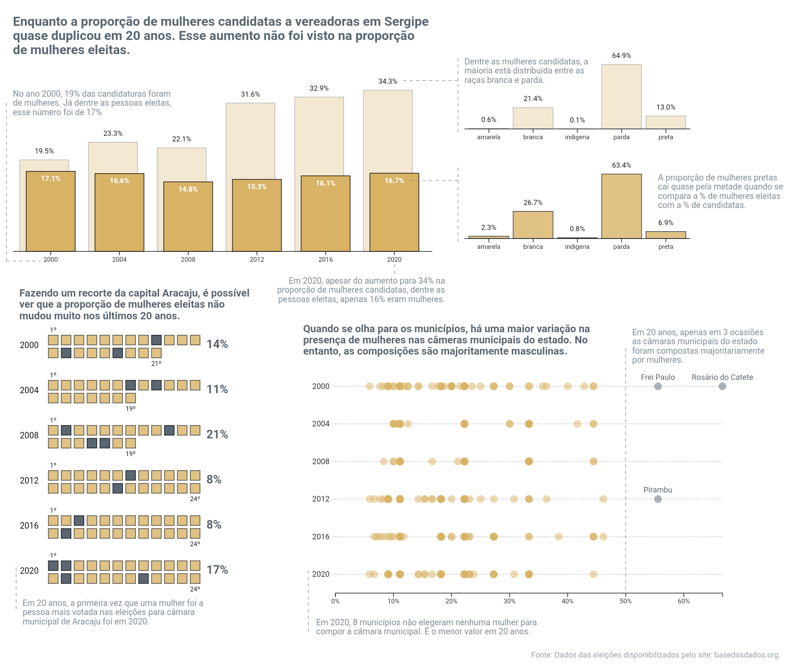

# Dados das Eleições - Base dos Dados

A visualização criada para este projeto pode ser vista na imagem a seguir: 

 

Toda a implementação foi desenvolvida em D3.js e pode ser encontrada no link: []. Os códigos da visualização também podem ser encontrados na pasta: code/viz.